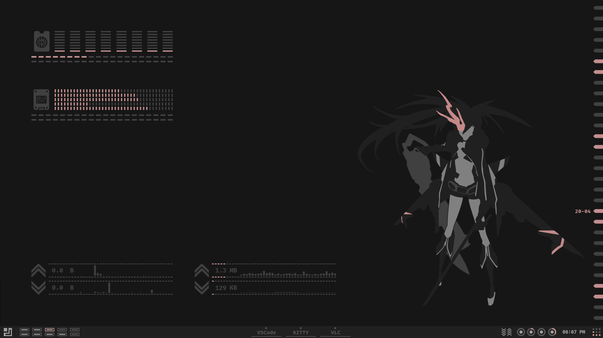
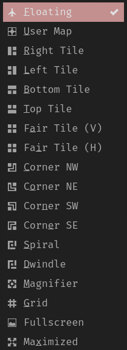
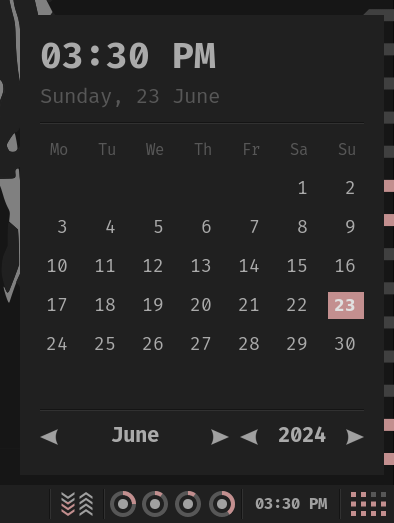
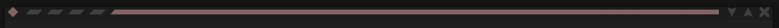
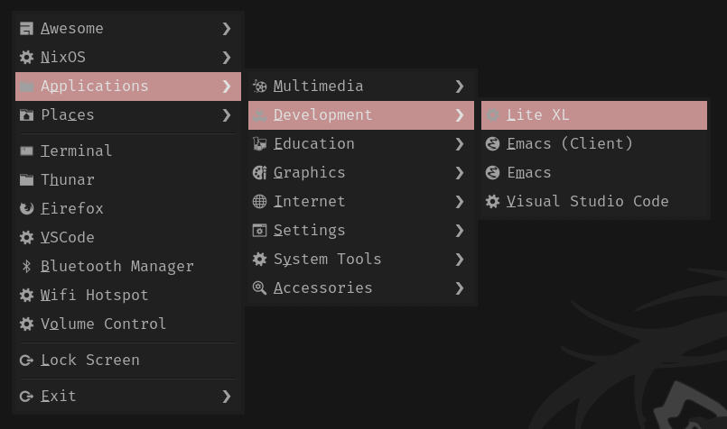
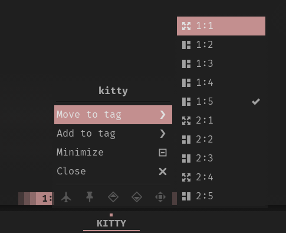
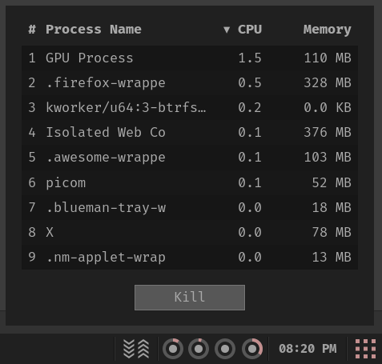
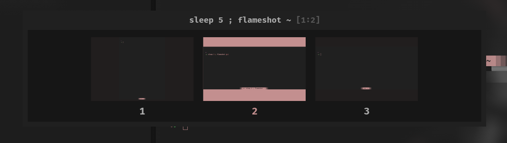
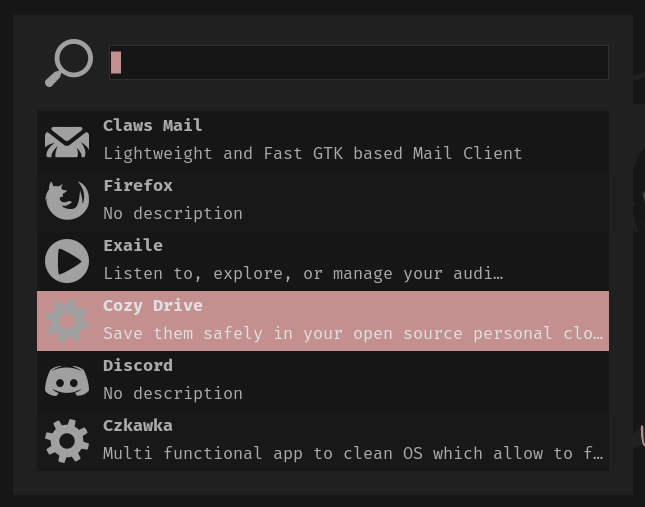
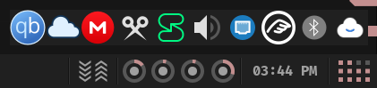

# About

My [Awesome Window Manager](https://awesomewm.org) configuration. It's a highly customized setup focused on a clean, efficient, and visually appealing desktop experience.

> [!NOTE]
> This repository is not meant to be used as a whole, but rather as a reference for my own configuration. I do not recommend using it as is, as it is not meant to be used by anyone else. I do not provide any support for this repository. If you want to use it, you are on your own.

> [!IMPORTANT]
> I'm using this [awesomewm](https://awesomewm.org) configuration on my [NixOS](https://nixos.org) systems, and you might notice some things that appear unusual, like the standard paths, e.g `/usr/share` equivalent for nix is `/run/current-system/sw/share` and for home-manager is `~/.local/state/home-manager/gcroots/current-home/home-path/share` on NixOS systems.

> [!TIP]  
> Use [LuaJIT](https://luajit.org) for best performance.
>
> For easy customization use [Xephyr](https://wiki.archlinux.org/title/Xephyr). See scripts directory.

## Desktop Screenshots




## Installation

```bash
git clone https://github.com/TanvirOnGH/awesomewm-config.git ~/.config/awesome --recursive
```

## Misc screenshots

### Window Layouts



### Time-Calendar widget



### Bar


### Window Titlebar

Mini:


Compact:



Full (default):


### Desktop Menu



### Window Menu



### Process List



### Application Switcher



### Application launcher



### Tray



### Calendar


## Acknowledgements

[worron/awesome-config](https://github.com/worron/awesome-config) Original configuration that served as the foundation for this project.

[flex](https://github.com/TanvirOnGH/flex) extension module for providing a collection of visually consistent and functional widgets, layout enhancements, and utilities.

The AwesomeWM community for their excellent window manager and helpful resources.
