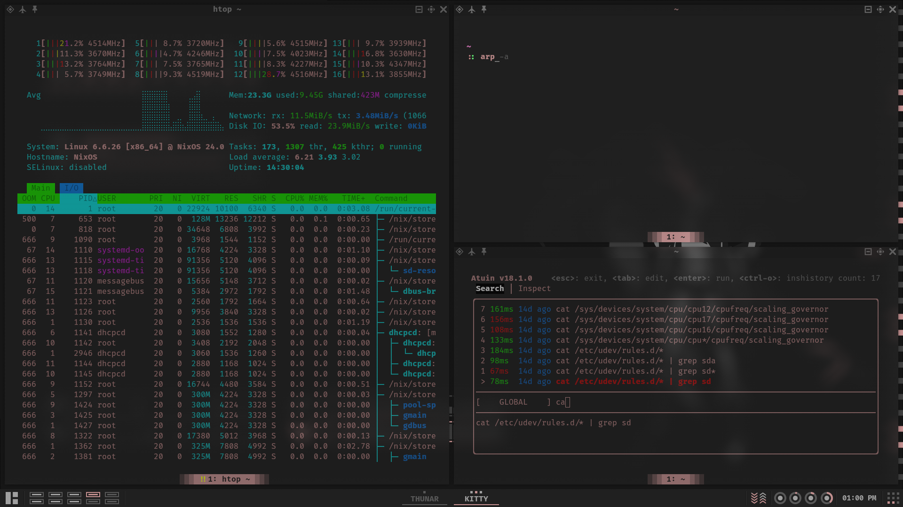

## About

My [awesome window manager](https://awesomewm.org) configuration (fork of [worron/awesome-config](https://github.com/worron/awesome-config))




## Installation

```bash
git clone https://github.com/TanvirOnGH/awesomewm-config.git ~/.config/awesome --recursive
```

## Note

I'm using this [awesomewm](https://awesomewm.org) configuration on my [NixOS](https://nixos.org) systems, and you might notice some things that appear unusual, like the standard paths, e.g `/usr/share` equivalent for nix is `/run/current-system/sw/share` and for home-manager is `~/.local/state/home-manager/gcroots/current-home/home-path/share` on NixOS systems.

Wallpapers aren't included for obvious reasons.

This repository is not meant to be used as a whole, but rather as a reference for my own configuration. I do not recommend using it as is, as it is not meant to be used by anyone else. I do not provide any support for this repository. If you want to use it, you are on your own.
